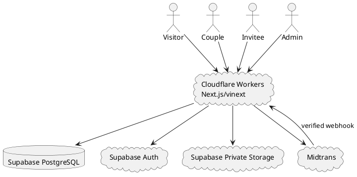

# SPEC-001-Weplan

## Background

Weplan adalah SaaS untuk membuat undangan pernikahan digital bertema. Pengunjung dapat memilih theme, memulai pengisian identitas tanpa akun, kemudian login/register sebelum membuat draft dan mengunggah media. Undangan baru menjadi publik setelah pembayaran Midtrans terverifikasi.

Target MVP adalah arsitektur yang dapat dibangun bertahap oleh AI coding docs/architecture/agent/contractor dengan biaya infrastruktur tetap serendah mungkin dan mengutamakan free tier.

## Requirements

### Must Have
- Auth email/password dan Google OAuth.
- Role `couple` dan `admin`.
- Home, Themes, demo theme, builder, dashboard couple/admin, public personalized invitation.
- Theme dipilih sebelum builder.
- Builder 8 langkah: Identity, Events, Story, Gallery/Video, Gifts, RSVP/Wishes config, Music, Review.
- Guest dapat mengisi field teks Step 1 sebelum login.
- Cover/groom/bride photo berada di akhir Step 1 dan upload memerlukan auth.
- Tier Basic/Premium/VIP menentukan harga, masa aktif, batas gallery/video.
- One payment = one invitation.
- Transaction menyimpan snapshot theme/tier/price/duration.
- Midtrans webhook terverifikasi adalah source of truth aktivasi.
- Personalized invitee token minimal 128-bit random.
- Token lookup disimpan SHA-256; recoverable copy-link disimpan encrypted.
- One RSVP dan one wish per invitee.
- Private Storage dan signed URLs.
- Invitation lifecycle draft -> payment_pending -> active -> expired -> hard delete setelah grace 7 hari.
- Transaction history tetap tersimpan setelah invitation dihapus.
- RLS dan server-side authorization.
- Homepage admin hanya show/hide section.
- Central website design tokens.
- Theme-specific visual/typography/animation source code.
- AI-agent task protocol dengan scoped context.

### Should Have
- Autosave authenticated draft.
- Disable theme tanpa hard delete.
- Generic expired page selama grace period.
- Regenerate invitee link.
- Backup/restore SOP.
- Structured operational logs.

### Could Have
- Renewal.
- Duplicate invitation.
- Custom domain.
- Voucher.
- QR code / WhatsApp share.
- Visit analytics.

### Won't Have in MVP
- Subscription billing.
- Vendor marketplace.
- Full homepage CMS.
- Theme visual builder.
- Native mobile app.
- Cart/multi-item checkout.

## Method

### System architecture

### Domain model
Core tables: profiles, tiers, themes, invitations, wedding_events, stories, gallery_items, gift_accounts, invitation_guests, rsvps, wishes, transactions, homepage_sections.

Detailed implementable SQL: `docs/architecture/database/schema.sql`, `docs/architecture/database/rls-policies.sql`, `docs/architecture/database/indexes.sql`.

### Theme engine
DB `themes.renderer_key` resolves through a source-code registry. Every theme receives a common `InvitationThemeProps` / view model. Tier controls entitlement; theme controls presentation.

### Builder
Step 1 begins locally for unauthenticated visitor. Before upload/continue, auth gate creates authenticated invitation draft. Remaining steps persist to database.

### Public invitee access
Public route hashes incoming token, resolves invitee, validates slug and active lifecycle, creates signed asset URLs, builds view model, then renders the selected source-code theme.

### Payment
Server derives theme/tier/price, writes transaction snapshot, creates Midtrans transaction, and sets payment_pending. Only verified, idempotent Midtrans notification may atomically mark transaction paid and activate invitation.

### Lifecycle
`draft -> payment_pending -> active -> expired -> hard delete`. Failed/expired/cancelled pending payment returns invitation to draft. Active expiry derives from paid time + transaction duration snapshot. Cleanup occurs after 7-day grace.

### Security
Authenticated user access is protected by RLS plus explicit server checks. Invitee mutations use token-authorized server endpoints; invitees do not query tables directly. Midtrans/Cron use server-only privileged credentials.

### Storage
Private bucket `invitation-assets`; paths use UUID ownership hierarchy. Browser optimizes images, requests an authorized signed upload, then uploads directly to Storage. Public invitation receives temporary signed read URLs only after lifecycle/token validation.

### Design system
Website UI uses centralized semantic CSS variables consumed by Tailwind/shadcn. Invitation themes use isolated theme tokens. No hardcoded brand colors in reusable application components.

### Animation
Tailwind/CSS for simple state transitions; Motion for React for opening/scroll/reveal animation. Prefer transform/opacity and respect reduced motion.

### Similar-product principle
Implementation should preserve common digital-invitation expectations—theme-first browsing, personalized links, RSVP/wishes, gifts, gallery, music—while keeping Weplan's renderer, entitlement, lifecycle, and payment boundaries independent. Competitive UX research should be refreshed immediately before product-polish work rather than copied into core domain logic.

## Implementation

Follow `docs/architecture/implementation/IMPLEMENTATION-PLAN.md` and the scoped files under `docs/architecture/tasks/`. AI agents must follow `AGENTS.md`; do not execute multiple phases in one context unless explicitly instructed.

## Milestones

See `docs/architecture/implementation/MILESTONES.md`. Milestones are deliverable/acceptance based, not percentage based.

## Gathering Results

Evaluate:
- funnel: theme viewed -> builder started -> builder completed -> checkout -> paid -> activated
- reliability: webhook, activation, upload, RSVP/wish, cron cleanup
- performance: mobile usability, optimized/lazy images, bounded JS/animation
- security: zero cross-user access, fake activation, cross-invitation mutation, leaked secrets/tokens
- recovery: docs/architecture/backup/restore drill

Production-critical failures such as paid transaction without activation require immediate engineering investigation.

## Need Professional Help in Developing Your Architecture?

Please contact me at [sammuti.com](https://sammuti.com) :)
